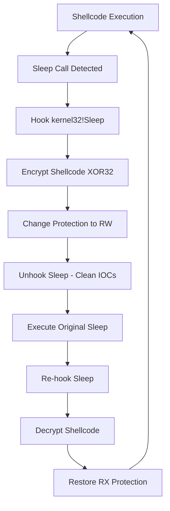
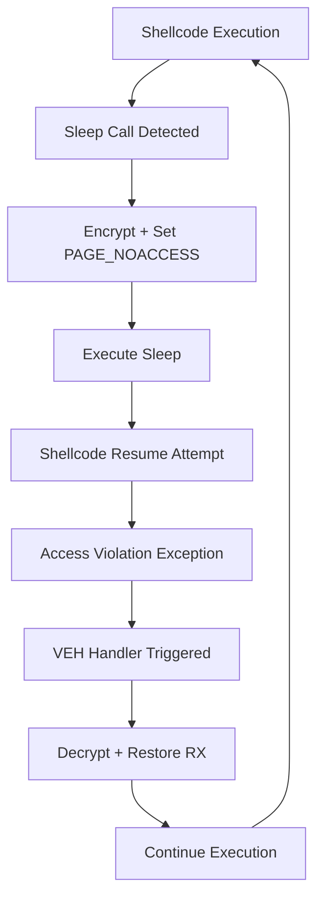

# 🔄 Shellcode Fluctuation

[](https://opensource.org/licenses/MIT)
[](https://www.microsoft.com/)
[](https://github.com/mgeeky/ShellcodeFluctuation)
[](https://isocpp.org/)
[](https://github.com/mgeeky/ShellcodeFluctuation)

> **A sophisticated proof-of-concept demonstrating advanced in-memory evasion techniques that cyclically encrypts and decrypts shellcode while fluctuating between different memory protection states to evade detection by memory scanners.**

## Table of Contents

- [Overview](#overview)
- [Key Features](#-key-features)
- [How It Works](#-how-it-works)
  - [RW Fluctuation Mode](#rw-fluctuation-mode)
  - [PAGE_NOACCESS Mode](#page_noaccess-mode)
- [Quick Start](#-quick-start)
  - [Prerequisites](#prerequisites)
  - [Building](#building)
  - [Usage](#usage)
- [Detection Analysis](#-detection-analysis)
  - [Moneta Scanner Results](#moneta-scanner-results)
  - [PE-Sieve Analysis](#pe-sieve-analysis)
- [Technical Deep Dive](#-technical-deep-dive)
  - [Memory Protection Mechanics](#memory-protection-mechanics)
  - [Hook Implementation](#hook-implementation)
  - [Encryption Strategy](#encryption-strategy)
- [Important Considerations](#️-important-considerations)
- [Educational Background](#-educational-background)
- [Defensive Implications](#️defensive-implications)
- [References](#references)

## Overview

**Shellcode Fluctuation** is an advanced cybersecurity research tool that demonstrates sophisticated memory evasion techniques used in modern malware and red team operations. The tool implements a novel approach to hiding shellcode in memory by:

- **Dynamic Encryption**: XOR32-based encryption/decryption of shellcode contents
- **Memory Protection Cycling**: Alternating between `RW`/`NoAccess` and `RX` memory states  
- **Sleep Hook Interception**: Leveraging `kernel32!Sleep` calls for timing control
- **Scanner Evasion**: Bypassing tools like [Moneta](https://github.com/forrest-orr/moneta) and [pe-sieve](https://github.com/hasherezade/pe-sieve)

### Live Demonstration

When shellcode resides in `RW` or `NoAccess` memory pages, advanced memory scanners cannot detect or dump it for analysis:

| State | Beacon Status | Scanner Detection |
|-------|---------------|-------------------|
| **Not Encrypted** | ❌ Visible | 🚨 **DETECTED** - Abnormal executable memory |
| **Encrypted (Fluctuating)** | ✅ Hidden | ✅ **EVADED** - No suspicious executable regions |


## Key Features

### Core Capabilities
- **Multi-Mode Operation**: Support for RW and PAGE_NOACCESS fluctuation modes
- **Self-Aware Shellcode**: Automatic detection and management of shellcode boundaries
- **Hook Management**: Intelligent hooking/unhooking to minimize IOCs
- **Cross-Architecture**: Compatible with both x86 and x64 Windows systems

### Evasion Techniques
- **Memory Scanner Bypass**: Evades Moneta, PE-Sieve, and similar tools
- **IOC Minimization**: Reduces detectable indicators of compromise
- **Dynamic Protection**: Real-time memory protection state changes
- **Encryption Cycling**: Continuous encryption/decryption during sleep cycles

### Target Compatibility
- **Primary**: Cobalt Strike Beacon shellcodes
- **Architecture**: Windows x86/x64 platforms
- **Requirements**: Shellcodes that utilize `kernel32!Sleep` for timing

## How It Works

The technique operates by intercepting the moment when shellcode enters a sleep state and performing cryptographic operations combined with memory protection changes.

### RW Fluctuation Mode



**Detailed Process:**

1. **Initialization**: Hook `kernel32!Sleep` with custom callback
2. **Injection**: Deploy shellcode via `VirtualAlloc` → `memcpy` → `CreateThread`
3. **Sleep Interception**: Custom `MySleep` callback triggers on sleep
4. **Encryption Phase**: XOR32 encrypt shellcode + flip to `PAGE_READWRITE`
5. **IOC Cleanup**: Temporarily unhook Sleep to avoid detection
6. **Sleep Execution**: Call original `::Sleep` function
7. **Decryption Phase**: Restore shellcode + flip back to `PAGE_EXECUTE_READ`
8. **Re-hook**: Reinstall Sleep hook for next cycle

### PAGE_NOACCESS Mode

This advanced mode, inspired by [ORCA666's research](https://github.com/ORCA666/0x41), uses Vectored Exception Handling (VEH):



**Key Advantages:**
- **Complete Invisibility**: Shellcode appears as inaccessible memory
- **Exception-Driven**: Automatic restoration on access attempts  
- **Enhanced Security**: Even more difficult to detect than RW mode

## Quick Start

### Prerequisites

- **OS**: Windows 10/11 (x86/x64)
- **Compiler**: Visual Studio 2019+ or compatible C++ compiler
- **Target**: Cobalt Strike Beacon or compatible shellcode

### Building

```bash
# Clone the repository
git clone https://github.com/mgeeky/ShellcodeFluctuation.git
cd ShellcodeFluctuation

# Open in Visual Studio
start ShellcodeFluctuation.sln

# Or build via command line
msbuild ShellcodeFluctuation.sln /p:Configuration=Release /p:Platform=x64
```

### Usage

```bash
ShellcodeFluctuation.exe <shellcode_file> <fluctuation_mode>
```

**Fluctuation Modes:**
- **`-1`** - **Analysis Mode**: Load but don't inject (IOC baseline testing)
- **`0`** - **Standard Mode**: Inject without fluctuation (detection comparison)  
- **`1`** - **RW Mode**: Fluctuate between RW and RX protection
- **`2`** - **NoAccess Mode**: Fluctuate between NoAccess and RX protection

**Example Usage:**
```bash
# Test baseline IOCs without injection
ShellcodeFluctuation.exe beacon64.bin -1

# Standard injection (detectable)
ShellcodeFluctuation.exe beacon64.bin 0

# RW fluctuation mode (evasive)
ShellcodeFluctuation.exe beacon64.bin 1

# PAGE_NOACCESS mode (maximum evasion)
ShellcodeFluctuation.exe beacon64.bin 2
```

## Detection Analysis

### Moneta Scanner Results

#### Baseline (No Fluctuation)
```
[DETECTED] Abnormal private executable memory
Region: 0x000002210C091000 - 0x000002210C0C0000
Protection: PAGE_EXECUTE_READ
Type: MEM_PRIVATE
```

#### With Fluctuation Active
```
[CLEAN] No abnormal executable memory detected
[INFO] Modified code in kernel32.dll (expected IOC)
```

### PE-Sieve Analysis

PE-Sieve detection requires the `/data 3` parameter to identify implanted PE modules. The tool successfully evades standard scanning modes but may trigger on advanced analysis due to kernel32 modifications.

**Detection Matrix:**

| Scanner | Mode | Standard Injection | RW Fluctuation | NoAccess Fluctuation |
|---------|------|-------------------|----------------|---------------------|
| Moneta | Default | 🚨 **DETECTED** | ✅ **EVADED** | ✅ **EVADED** |
| PE-Sieve | Default | 🚨 **DETECTED** | ✅ **EVADED** | ✅ **EVADED** |
| PE-Sieve | `/data 3` | 🚨 **DETECTED** | ⚠️ **PARTIAL** | ⚠️ **PARTIAL** |

## 🔍 Technical Deep Dive

### Memory Protection Mechanics

The core technique leverages Windows memory management APIs to create a dynamic protection scheme:

```cpp
// Encryption + Protection Change
VirtualProtect(shellcodeAddr, size, PAGE_READWRITE, &oldProtect);
xor32(shellcodeBuffer, size, encryptionKey);

// For NoAccess mode
VirtualProtect(shellcodeAddr, size, PAGE_NOACCESS, &oldProtect);
```

### Hook Implementation

The hooking mechanism uses a fast trampoline technique:

```cpp
// x64 Trampoline
uint8_t trampoline[] = {
    0x49, 0xBA, 0x00, 0x00, 0x00, 0x00, 0x00, 0x00, 0x00, 0x00, // mov r10, addr
    0x41, 0xFF, 0xE2                                            // jmp r10
};
```

### Encryption Strategy

**XOR32 Implementation:**
- **Key Generation**: Cryptographically secure random 32-bit keys
- **Performance**: Optimized 32-bit operations with byte-level fallback
- **Coverage**: Complete shellcode region encryption

## Important Considerations

### Limitations & Warnings

- **Educational Purpose**: This is a research tool for educational and authorized testing only
- **Cobalt Strike Specific**: Designed specifically for Beacon shellcodes using `Sleep`
- **Hook Dependencies**: Requires `kernel32!Sleep` calls for operation
- **IOC Awareness**: Leaves minimal but detectable kernel32 modification traces

### Responsible Usage

- **Authorized Testing**: Only use in authorized penetration testing environments
- **Red Team Exercises**: Appropriate for legitimate adversary simulation
- **Malicious Use**: Not intended for criminal activities or unauthorized access
- **Research**: Valuable for understanding modern evasion techniques

### Cleanup Considerations

**Important**: Avoid unhooking `kernel32.dll` during operation as this will prevent the fluctuation mechanism from functioning. If using tools like `unhook-bof`, exclude kernel32:

```bash
beacon> unhook kernel32
[*] Will skip these modules: kernel32.dll
```

## Educational Background

This technique builds upon foundational research in memory evasion:

### Historical Context

- **[Gargoyle](https://github.com/JLospinoso/gargoyle)** by Josh Lospinoso - Original memory protection cycling concept
- **[ORCA666's 0x41](https://github.com/ORCA666/0x41)** - PAGE_NOACCESS implementation inspiration
- **[ThreadStackSpoofer](https://github.com/mgeeky/ThreadStackSpoofer)** - Complementary thread-level evasion

### Recommended Reading

1. **[Gargoyle: Memory Scanning Evasion](https://lospi.net/security/assembly/c/cpp/developing/software/2017/03/04/gargoyle-memory-analysis-evasion.html)**
2. **[Bypassing Memory Scanners with Cobalt Strike](https://labs.f-secure.com/blog/experimenting-bypassing-memory-scanners-with-cobalt-strike-and-gargoyle/)**
3. **[Masking Malicious Memory Artifacts](https://www.forrest-orr.net/post/malicious-memory-artifacts-part-i-dll-hollowing)** by Forrest Orr

## Defensive Implications

### Detection Strategies

**For Blue Teams and Security Researchers:**

- **Memory Working Set Analysis**: Monitor for unusual private memory allocations within image regions
- **Hook Detection**: Implement kernel32 integrity checking
- **Behavioral Analysis**: Look for patterns of memory protection changes
- **VEH Monitoring**: Track Vectored Exception Handler registrations

### IOC Patterns

- Modified code regions in kernel32.dll (minimal but detectable)
- Unusual memory protection change patterns
- Private memory allocations within system library regions
- Frequent VirtualProtect API calls with protection cycling


## References

### Research Papers & Articles
- [Masking Malicious Memory Artifacts - Part I](https://www.forrest-orr.net/post/malicious-memory-artifacts-part-i-dll-hollowing)
- [Masking Malicious Memory Artifacts - Part II](https://www.forrest-orr.net/post/masking-malicious-memory-artifacts-part-ii-insights-from-moneta)  
- [Masking Malicious Memory Artifacts - Part III](https://www.cyberark.com/resources/threat-research-blog/masking-malicious-memory-artifacts-part-iii-bypassing-defensive-scanners)
- [Hook Heaps and Live Free](https://www.arashparsa.com/hook-heaps-and-live-free/)

### Related Tools
- [Moneta](https://github.com/forrest-orr/moneta) - Memory scanner for detecting malicious artifacts
- [PE-Sieve](https://github.com/hasherezade/pe-sieve) - Scans for inline hooks and other modifications
- [BeaconEye](https://github.com/CCob/BeaconEye) - Beacon configuration extractor
- [ThreadStackSpoofer](https://github.com/mgeeky/ThreadStackSpoofer) - Thread call stack spoofing


---

<div align="center">

**⚠️ DISCLAIMER ⚠️**

*This tool is provided for educational and authorized security testing purposes only. Users are responsible for complying with applicable laws and regulations. The author assumes no liability for misuse or damage caused by this software.*

**🔒 Use Responsibly | 🎓 Learn Continuously | 🛡️ Defend Effectively**

</div>
